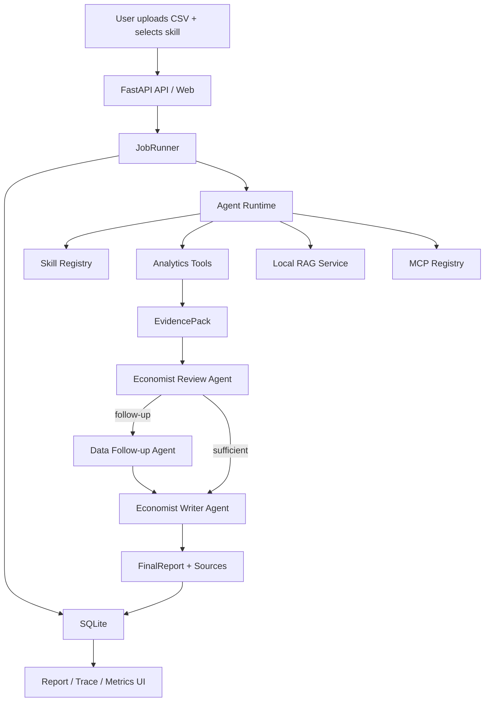

# Economic Agent Platform

An AI Agent runtime platform for economic analysis, built to be both demo-ready and resume-ready.

This project is no longer just a CSV-to-report demo. It now presents a lightweight agent engineering stack with:

- `Skill` orchestration for multiple analysis flows
- `Progressive Skill Disclosure` so different runtime phases only expose the capabilities they need
- `Tool` execution for structured dataset analysis
- `RAG` augmentation over local knowledge documents
- `MCP-style` external source adapters for economic and research context
- `Goal Summary / Context Mainline` for stable long-task state tracking
- `Trace + metrics` persistence for observability and interview-ready storytelling

## Why This Project Matters

This repo is designed to show AI Agent engineering depth instead of prompt chaining alone.

- The runtime can switch between multiple skills instead of running one hard-coded flow
- The runtime can progressively disclose tools, RAG, and MCP sources by phase instead of exposing everything at once
- Local analysis and external context are separated into `Tool`, `RAG`, and `MCP` layers
- The backend exposes job status, report retrieval, goal summary, trace inspection, source references, and knowledge search APIs
- SQLite persists jobs, artifacts, agent runs, runtime calls, source references, and metrics
- The web UI makes the runtime behavior visible enough to discuss architecture and observability in interviews

## Core Features

### Skill-driven runtime

- `economic_report`
  - Full economic analysis report with charts and references
- `anomaly_investigation`
  - Focused investigation of abnormal cities and metrics
- `policy_briefing`
  - Short analysis with external research and policy-style framing

### Progressive skill disclosure

- `data_analysis`
  - expose structured dataset tools first
- `economist_review`
  - expose lightweight retrieval and limited external context
- `economist_follow_up`
  - disclose targeted follow-up tools only after evidence gaps are confirmed
- `economist_writer`
  - focus on synthesis, references, and final report generation

### Context mainline

- append-only `Goal Summary` versions for each critical job stage
- stable task mainline fields:
  - `overall_goal`
  - `current_stage`
  - `completed_steps`
  - `key_findings`
  - `next_action`
- dedicated API and UI block for latest summary display

### Runtime layers

- `Agent`
  - `Data Analyst Agent`
  - `Economist Review Agent`
  - `Economist Writer Agent`
- `Tool`
  - `inspect_dataset`
  - `latest_snapshot`
  - `city_rankings`
  - `city_trend`
  - `income_group_comparison`
  - `detect_anomalies`
  - `build_chart_payload`
- `RAG`
  - local markdown knowledge retrieval from `knowledge/`
- `MCP`
  - `economic-data` adapter
  - `research` adapter

### APIs

- `POST /api/jobs`
- `GET /api/jobs/{job_id}`
- `GET /api/jobs/{job_id}/report`
- `GET /api/jobs/{job_id}/goal-summary`
- `GET /api/jobs/{job_id}/trace`
- `GET /api/jobs/{job_id}/sources`
- `GET /api/skills`
- `GET /api/knowledge/search?q=...`

### Observability

- SQLite trace persistence
- runtime call classification: `tool / rag / mcp`
- failure taxonomy:
  - `model_error`
  - `tool_error`
  - `rag_error`
  - `mcp_error`
  - `schema_validation_error`
- metrics log for:
  - job lifecycle
  - skill selection
  - RAG retrieval counts
  - MCP call counts

## Evolution

This project is intentionally built as an engineering evolution instead of a one-shot demo:

1. `Initial version`
- solve the end-to-end path from CSV upload to final report

2. `First upgrade`
- introduce `Skill / Tool / RAG / MCP / Trace`
- turn the project into an extensible, observable Agent runtime

3. `Second upgrade`
- introduce `Goal Summary / Context Mainline`
- stabilize long-task goal tracking and stage progression

4. `Latest runtime upgrade`
- introduce `Progressive Skill Disclosure`
- expose different capabilities by phase instead of revealing the whole tool surface at once

## Chinese Engineering Notes

Interview-facing Chinese design notes live in `docs/`:

- [第一次升级面试回答稿](docs/first_upgrade_interview_answer_guide.md)
- [上下文主线升级说明](docs/context_mainline_upgrade.md)
- [三阶段演进面试稿](docs/agent_project_evolution_interview_guide.md)
- [Skill 渐进式披露升级说明](docs/skill_progressive_disclosure_upgrade.md)
- [Skill 渐进式披露设计文档](docs/skill_progressive_disclosure_design.md)

## Architecture



## Project Structure

```text
app/
  agents/
    orchestrator.py
  services/
    analytics.py
    knowledge_base.py
    mcp.py
    observability.py
    rag.py
  static/
  templates/
  cli.py
  jobs.py
  main.py
  schemas.py
  skills.py
  storage.py
docs/
  adr/
  agents/
knowledge/
tests/
```

## Run Locally

1. Create a virtual environment

```powershell
python -m venv .venv
.venv\Scripts\activate
```

2. Install dependencies

```powershell
pip install -e .[dev]
```

3. Configure environment variables

```powershell
Copy-Item .env.example .env
```

`OPENAI_API_KEY` is optional. Without it, the app still runs via the local fallback runtime.

4. Start the app

```powershell
uvicorn app.main:app --reload
```

5. Open:

- [Home](http://127.0.0.1:8000/)
- [API docs](http://127.0.0.1:8000/docs)

## CLI Demo

```powershell
python -m app.cli run-local --file "D:\working\AI agent\economic agent\data\Employment - City - Weekly.csv" --skill policy_briefing
```

## Testing

```powershell
pytest
```

Covered scenarios include:

- dataset loading
- analytics contract
- skill registry
- progressive skill disclosure contract
- local RAG retrieval
- default job flow
- alternate skill flow
- knowledge search API

## Resume-Friendly Highlights

- Designed and implemented an AI Agent runtime platform with `Agent + Skill + Tool` layering on top of `FastAPI + OpenAI Agents SDK + SQLite`
- Added local RAG and MCP-style source adapters to combine structured analysis with external economic context
- Added `Goal Summary` and progressive skill disclosure to improve task mainline stability and phase-level capability governance
- Built traceability and observability primitives across agent runs, runtime calls, source references, metrics, and failure categories

## Suggested Resume Title

`Agent Runtime Platform for Economic Analysis | 支持 Skill、RAG、MCP、任务主线与渐进式披露的 AI Agent 平台`

## Suggested GitHub Description

`A resume-ready AI Agent runtime platform for economic analysis with skills, progressive disclosure, goal summaries, RAG, MCP adapters, and observability.`
