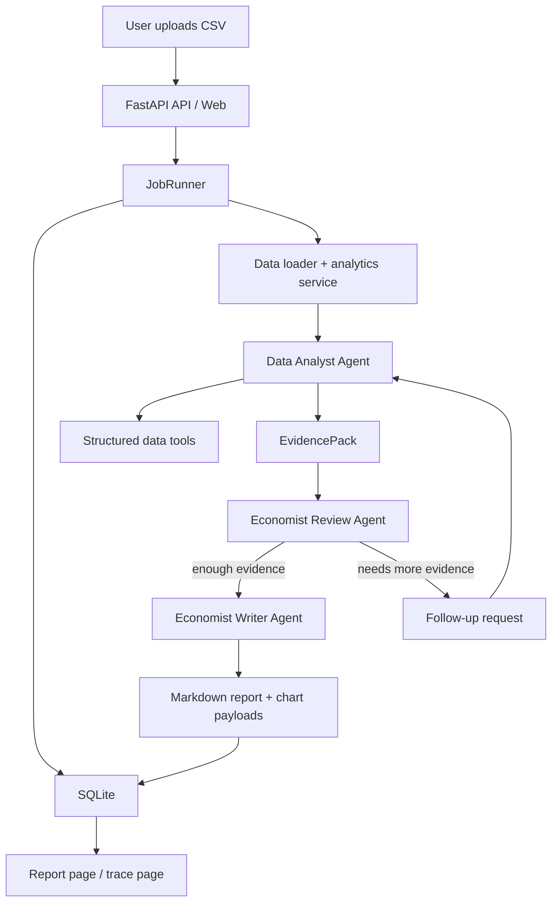

# Economic Agent Platform

面向简历展示和面试讲解的双 Agent 经济数据分析平台。这个项目不是单纯把 CSV 丢给大模型总结，而是把 `多 Agent 协作`、`工具调用`、`异步任务编排`、`结果持久化` 和 `轻量 Web 展示` 组合成一个可以实际运行的后端型 AI agent 系统。

## Why This Project Matters

这个项目适合写进后端 / AI agent 全栈方向简历，原因很直接：

- `Data Analyst Agent` 不直接读取整张表，而是通过结构化工具观察数据
- `Economist Agent` 负责审查证据、请求补充分析并输出中文报告
- 后端提供任务创建、状态查询、报告获取、trace 查询等 API
- SQLite 持久化了任务状态、agent 运行记录、工具调用日志和分析产物
- Web 页面能看到上传、状态流转、报告结果和 agent/tool trace

## Core Features

- 双 Agent 分工
  - `Data Analyst Agent`：负责数据工具调用与 `EvidencePack` 生成
  - `Economist Review Agent`：负责审核证据并决定直接出报告还是请求补充分析
  - `Economist Writer Agent`：负责生成最终中文报告
- 工具调用链路
  - `inspect_dataset`
  - `latest_snapshot`
  - `city_rankings`
  - `city_trend`
  - `income_group_comparison`
  - `detect_anomalies`
  - `build_chart_payload`
  - `read_indicator_definitions`
  - `read_methodology_notes`
  - `read_report_rubric`
- 服务化运行
  - `POST /api/jobs`
  - `GET /api/jobs/{job_id}`
  - `GET /api/jobs/{job_id}/report`
  - `GET /api/jobs/{job_id}/trace`
- 轻量前端
  - Jinja2 + HTMX + Chart.js
  - 上传 CSV、查看任务状态、查看报告和图表、查看 trace
- 本地可演示
  - 未配置 `OPENAI_API_KEY` 时可走 fallback 路径，方便本地完整演示

## Tech Stack

- Python 3.10
- FastAPI
- OpenAI Agents SDK
- OpenAI Responses API
- SQLite
- Jinja2 + HTMX + Chart.js
- Pydantic

## Architecture



## Project Structure

```text
app/
  agents/
    orchestrator.py
  services/
    analytics.py
    data_loader.py
    knowledge_base.py
  templates/
  static/
  cli.py
  jobs.py
  main.py
  schemas.py
  storage.py
knowledge/
data/
tests/
```

## Data Flow

1. 用户上传 CSV 或通过 CLI 指定本地文件。
2. 后端创建任务并写入 `analysis_jobs`。
3. worker 加载数据并构建基础分析上下文。
4. `Data Analyst Agent` 通过工具调用形成 `EvidencePack`。
5. `Economist Review Agent` 审核证据，必要时请求一次补充分析。
6. `Economist Writer Agent` 生成中文 Markdown 报告。
7. 系统把图表、报告、agent 运行记录和工具 trace 持久化到 SQLite。

## Run Locally

1. 创建虚拟环境

```powershell
python -m venv .venv
.venv\Scripts\activate
```

2. 安装依赖

```powershell
pip install -e .[dev]
```

3. 配置环境变量

```powershell
Copy-Item .env.example .env
```

然后填写 `OPENAI_API_KEY`。如果暂时不填，系统也可以通过 fallback 流程完成本地演示。

4. 启动服务

```powershell
uvicorn app.main:app --reload
```

5. 打开页面

- 首页：[http://127.0.0.1:8000/](http://127.0.0.1:8000/)
- API 文档：[http://127.0.0.1:8000/docs](http://127.0.0.1:8000/docs)

## CLI Demo

```powershell
python -m app.cli run-local --file "D:\working\AI agent\economic agent\data\Employment - City - Weekly.csv"
```

## Example Deliverables

- 中文经济分析 Markdown 报告
- 三类图表数据
  - 总体趋势折线图
  - 城市 Top/Bottom 柱状图
  - 收入组对比图
- Agent trace
  - agent 交接记录
  - 工具调用参数与结果摘要
  - 任务状态流转

## Testing

```powershell
pytest
```

当前项目已覆盖：

- 数据加载基础契约
- 分析服务输出契约
- API 端到端任务流

## Resume-Friendly Highlights

如果你要把它写进简历，建议突出这些点：

- 设计并实现基于 OpenAI Agents SDK 的多 Agent 经济数据分析平台
- 将工具调用、Agent handoff、异步任务状态机和 SQLite trace 持久化串成完整后端链路
- 使用 FastAPI 暴露分析任务 API，并通过 Jinja2/HTMX/Chart.js 提供轻量可视化界面
- 通过结构化 schema 约束 agent 中间协议，降低自由文本链路的不稳定性

## Notes

- 当前演示数据以 `cityid` 展示城市；若补充映射表，可进一步升级为城市名展示
- 当前知识库为本地 Markdown 文档，便于演示“agent 通过工具读取业务规则”
- 当前分析层使用纯 Python 标准库实现，便于在本地环境直接跑通
